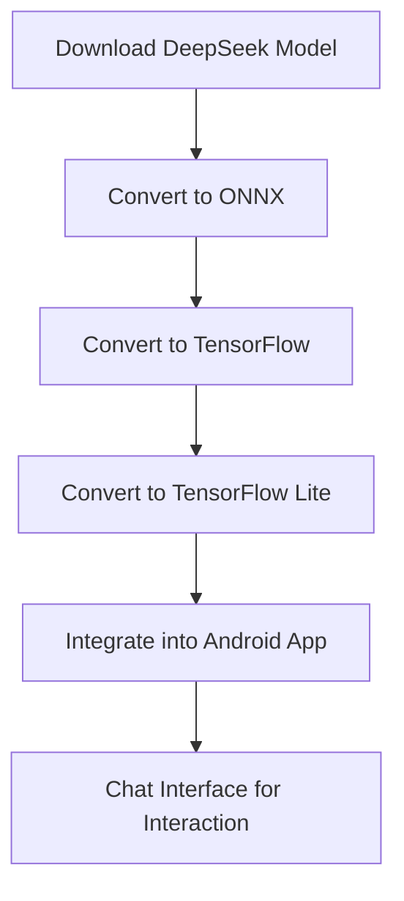

# deepseek-ai-for-android

Here’s a detailed **README.md** file formatted for GitHub to document your tutorial:

```markdown
# How to Use DeepSeek AI Model in Android Apps 🚀

This repository provides a **step-by-step guide** on how to use the **DeepSeek AI** model in Android apps. Although the model size is quite large for mobile devices (the smallest model is around 4GB), it's still an exciting experiment worth trying!

### Model Used:
👉 [DeepSeek-R1-Distill-Qwen-1.5B](https://huggingface.co/deepseek-ai/DeepSeek-R1-Distill-Qwen-1.5B)  

## Overview 📖
1. **Download the DeepSeek Model** from Hugging Face.
2. **Convert the Model** into ONNX, TensorFlow, and TensorFlow Lite formats.
3. **Implement a Chat Interface** in an Android app using Jetpack Compose.

---

## Step 1: Download the DeepSeek Model 🧩
1. Visit the model page on Hugging Face: [DeepSeek-R1-Distill-Qwen-1.5B](https://huggingface.co/deepseek-ai/DeepSeek-R1-Distill-Qwen-1.5B).
2. Clone the repository or download the model files directly:
   ```bash
   git clone https://huggingface.co/deepseek-ai/DeepSeek-R1-Distill-Qwen-1.5B
   ```

---

## Step 2: Convert the Model to ONNX Format 🔄
ONNX allows the model to be compatible with different frameworks. Use the following Python script to convert the Hugging Face model to ONNX:

```python
from transformers import AutoModelForCausalLM, AutoTokenizer
import torch
from onnxruntime.transformers import optimizer

# Load the DeepSeek model and tokenizer
model_name = "deepseek-ai/DeepSeek-R1-Distill-Qwen-1.5B"
model = AutoModelForCausalLM.from_pretrained(model_name)
tokenizer = AutoTokenizer.from_pretrained(model_name)

# Convert to ONNX
dummy_input = tokenizer("Hello, how are you?", return_tensors="pt")
torch.onnx.export(
    model,
    (dummy_input["input_ids"],),
    "deepseek_model.onnx",
    input_names=["input_ids"],
    output_names=["output"],
    dynamic_axes={"input_ids": {0: "batch_size", 1: "sequence_length"}}
)
```

---

## Step 3: Convert ONNX to TensorFlow Model 🔧
Use the `onnx-tf` library to convert the ONNX model to TensorFlow format:
```bash
pip install onnx-tf
```

Then run the following script:
```bash
from onnx_tf.backend import prepare
import onnx

# Load the ONNX model
onnx_model = onnx.load("deepseek_model.onnx")

# Convert to TensorFlow
tf_rep = prepare(onnx_model)
tf_rep.export_graph("deepseek_model_tf")
```

---

## Step 4: Convert TensorFlow Model to TensorFlow Lite 🪶
Reduce the model size by converting it into a TensorFlow Lite (TFLite) model.

Install TensorFlow Lite:
```bash
pip install tensorflow
```

Run the script:
```python
import tensorflow as tf

# Convert the TensorFlow model to TFLite
converter = tf.lite.TFLiteConverter.from_saved_model("deepseek_model_tf")
tflite_model = converter.convert()

# Save the TFLite model
with open("deepseek_model.tflite", "wb") as f:
    f.write(tflite_model)
```

---

## Step 5: Integrate the TFLite Model into Android App 📱
### Add TFLite Dependencies
Add the TensorFlow Lite dependency to your Android app's `build.gradle`:
```gradle
implementation 'org.tensorflow:tensorflow-lite:2.12.0'
implementation 'org.tensorflow:tensorflow-lite-support:0.4.0'
```

### Create a Simple Chat Interface
Use **Jetpack Compose** for a chat-like UI. Here’s the full Kotlin code:

```kotlin
import android.os.Bundle
import androidx.activity.ComponentActivity
import androidx.activity.compose.setContent
import androidx.compose.foundation.layout.*
import androidx.compose.foundation.text.BasicTextField
import androidx.compose.material3.*
import androidx.compose.runtime.*
import androidx.compose.ui.Modifier
import androidx.compose.ui.unit.dp
import androidx.lifecycle.lifecycleScope
import kotlinx.coroutines.Dispatchers
import kotlinx.coroutines.launch

class MainActivity : ComponentActivity() {
    override fun onCreate(savedInstanceState: Bundle?) {
        super.onCreate(savedInstanceState)
        setContent {
            ChatScreen()
        }
    }
}

@Composable
fun ChatScreen() {
    var userInput by remember { mutableStateOf("") }
    var response by remember { mutableStateOf("Hi! How can I help you?") }

    Column(
        modifier = Modifier.fillMaxSize().padding(16.dp),
        verticalArrangement = Arrangement.SpaceBetween
    ) {
        Text(
            text = "Chat with DeepSeek AI",
            style = MaterialTheme.typography.headlineMedium,
            modifier = Modifier.padding(bottom = 8.dp)
        )
        Column(
            modifier = Modifier.weight(1f).padding(bottom = 16.dp)
        ) {
            Text(text = response, modifier = Modifier.fillMaxWidth().padding(8.dp))
        }
        BasicTextField(
            value = userInput,
            onValueChange = { userInput = it },
            modifier = Modifier.fillMaxWidth().padding(8.dp)
        )
        Button(
            onClick = {
                // Call the TFLite model for a response
                response = "Model processing: $userInput"
            },
            modifier = Modifier.fillMaxWidth()
        ) {
            Text(text = "Send")
        }
    }
}
```

---

## Flow Diagram 📊
Below is a simple flowchart for the complete process:



---

## Conclusion 🎉
The DeepSeek AI model offers a powerful way to integrate advanced AI into Android apps. Although the size makes it challenging for mobile devices, it’s a step towards the future of on-device intelligence. 🧠  

For any issues or questions, feel free to raise a GitHub issue or connect with me on [LinkedIn](https://www.linkedin.com/in/codewithpk/).  

Visit More Tutorials on my website [CodeWithPK.com](https://codewithpk.com/).  

---

**Happy Coding!** 💻✨
``` 

Feel free to copy, customize, and upload it to your GitHub repository! 😊
